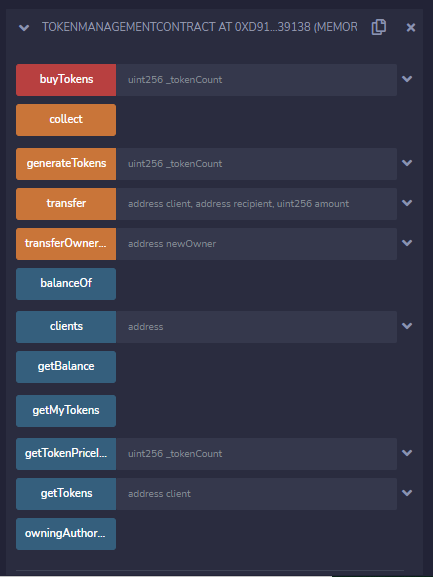
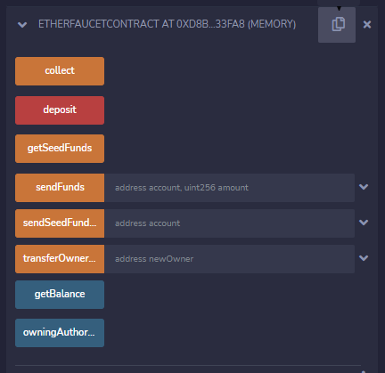
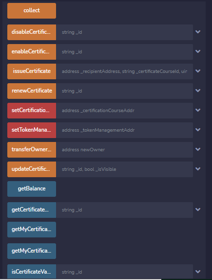
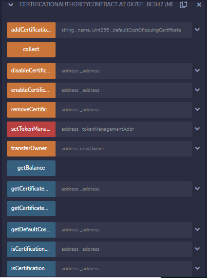
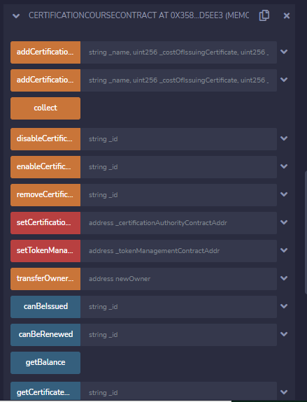
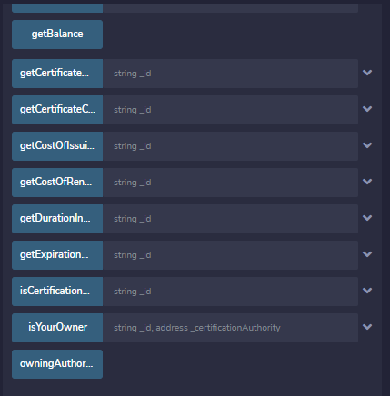
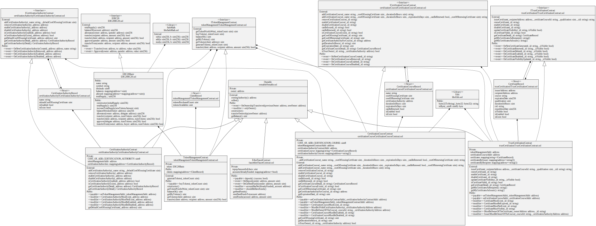

# Trust certification system decentralized application

Decentralized application designed to guarantee the transparency, traceability, security and truthfulness of the certificates issued by certification authorities.
This DApp has been deployed in a private Ethereum-based blockchain network as part of the Trust Certification System Platform project, therefore a faucet mechanism has been implemented as a source of ETH revenue issuance.

It implements its own ERC-20 token called TCS used as a transmission currency to carry out the different operations on the DApp.

It has been implemented using the Solidity programming language in the Remix IDE development environment.

## Main features of TCS ERC-20 tokens

* It has a name or identifier and an associated symbol. Through these two values, it is possible to identify and differentiate these tokens from others within the Ethereum blockchain.
* It is capable of managing the basic economic aspects of its issue. Data such as the decimal precision system and the total emission are a fundamental part of the token in its data structure.
* It manages an interface to control and review the balances of the addresses of its owners. By this means, the token is able to report the total balance of funds contained in a specific address.
* It can handle the transfer system natively. This is because the token has functions to handle fund transfers.
* Additionally, the token is capable of autonomously handling partial withdrawals of funds from one address.

## Main Components

### TCS Token Management Contract

### Ether Faucet Contract

### Trust Certification Contract

### Certification Authority Contract

### Certification Course Contract

## Main Goals

## UML Design Diagram

