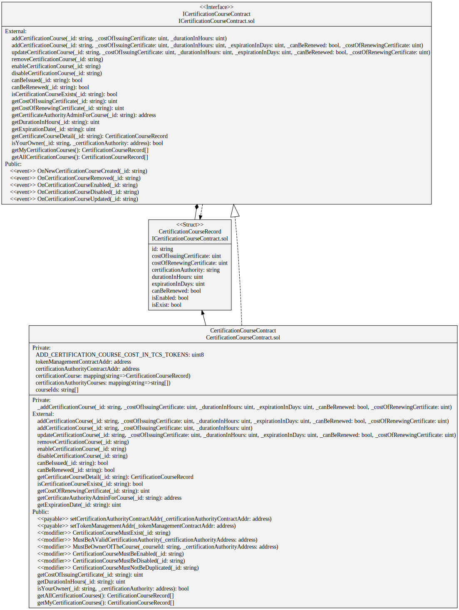

# Trust certification system decentralized application

Decentralized application designed to guarantee the transparency, traceability, security and truthfulness of the certificates issued by certification authorities.
This DApp has been deployed in a private Ethereum-based blockchain network as part of the [Trust Certification System Platform project](https://github.com/sergio11/trust_certification_system_blockchain), therefore a faucet mechanism has been implemented as a source of ETH revenue issuance.

It implements its own ERC-20 token called TCS used as a transmission currency to carry out the different operations in the DApp.

It has been implemented using the Solidity programming language in the Remix IDE development environment.

Also you can read more detail information about this project [in this Medium article](https://sanchezsanchezsergio418.medium.com/trust-certification-system-safeguarding-academic-integrity-with-blockchain-b212c78789e4).

 

  
  
  

## Main Goals

The decentralized application is based on a set of smart contracts that interact with each other in order to guarantee the security and reliability of the information stored.

* This application has been designed and developed to be deployed on a private Ethereum blockchain, therefore a Faucet mechanism has been implemented to provide funds in ETH for the wallets that operate with the application.
* The application uses tokens TCS that follows the ERC-20 standard in order to manage the fee of information registration operations in the blockchain.
* The CAs will be the entities authorized to register courses and issue digital certificates.

## How to deploy Trust Certification System DApp into a private Ethereum Blockchain Network

## Main Components

### Ether Faucet Contract

Faucet contract that dispenses ETH when a user makes a request. Just like small drops of water dripping from a faucet a crypto faucet drips amounts of ETH to requestors.

* Contract has an owner that can be changed.
* Has a configurable amount of ETH to dispense to each requested wallet.
* Supports donations to the faucet (this operation only could be made by contract owner).
* Keeps track of addresses requesting ETH.
* Requesters can request WITH only one time although contract owner could send funds to whatever wallet as much as he wants.

### TCS Token Management Contract

Faucet contract to dispense an ERC20 token called TCS. ERC20 token faucets are similar in concept to the contract above but their contract structure IS different. The ERC20 faucet contract below contains the following features:

* Unlike the contract above the contract below creates an ERC20 token.
* It provide a name and an symbol for the token.
* It inherits all of the functions of standard ERC20 contract definition.
* The owner mints tokens in the constructor.
* It keeps track of addresses requesting the ERC20 token.
* Requestors can buy the ERC20 token in exchange of ETH in order to can operate with others Smart Contracts.

### TCS ERC-20 token

The ERC-20 (Ethereum Request for Comments 20), proposed by Fabian Vogelsteller in November 2015, is a token standard that implements an API for tokens within smart contracts.

Functionalities provided by ERC-20:

* Transfer tokens from one account to another.
* Get the current token balance of an account.
* Get the total supply of the token available on the network.
* Approve whether a number of tokens from one account can be spent with a third-party account.

Main features of TCS ERC-20 tokens

* It has a name or identifier and an associated symbol. Through these two values, it is possible to identify and differentiate these tokens from others within the Ethereum blockchain.
* It is capable of managing the basic economic aspects of its issue. Data such as the decimal precision system and the total emission are a fundamental part of the token in its data structure.
* It manages an interface to control and review the balances of the addresses of its owners. By this means, the token is able to report the total balance of funds contained in a specific address.
* It can handle the transfer system natively. This is because the token has functions to handle fund transfers.
* Additionally, the token is capable of autonomously handling partial withdrawals of funds from one address.

If a smart contract implements the following methods and events, an ERC-20 token contract can be called, and once implemented, it will be responsible for keeping track of the tokens created on Ethereum.

### Certification Authority Contract

Smart Contract in charge of registering the certification authorities enabled for the creation of courses and issuance of digital certificates.

Registration operations have a cost in ERC-20 TCS tokens, it delegates into the Faucet ERC-20 TCS contract to manage the operations with the tokens.

### Certification Course Contract

Smart contract that manages the courses registered by the CAs enabled to issue digital certificates.

The creation of a new course through this smart contract has an extra cost in ERC-20 TCS tokens, these operations are managed using the Faucet ERC-20 TCS contract.

### Trust Certification Contract

Smart contract that manages digital certificates issued by CAs to usersinterested.

## UML Design Diagram

Complete UML diagram of decentralized application design.

## Visitors Count

## Please Share & Star the repository to keep me motivated.
  
  

